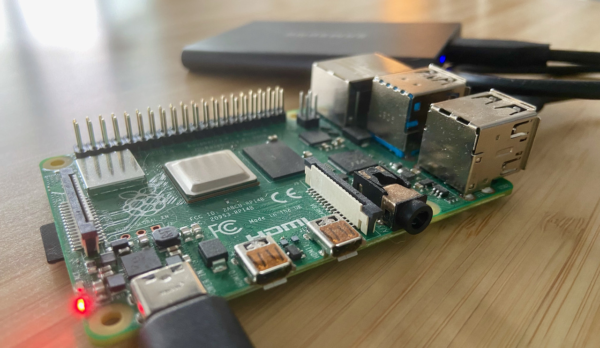
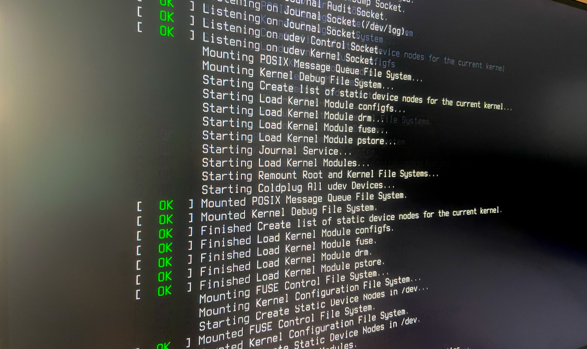

+++
title = "NixOS on Raspberry Pi 4"
[taxonomies]
tags = [ "NixOS", "Raspberryi Pi" ]
+++



I've had a Raspberry Pi 4 knocking around for a while. I'd been meaning to install NixOS on it but didn't really have the time. That may have worked to my advantage, because NixOS has much better support for the Raspberry Pi 4 now, but it was still a bit of a challenge.

The following documents the steps that I took to get NixOS installed on the Pi. It was not as simple as I had been hoping it would be, and I ended up having to cobble together the configuration steps from a bunch of different places in order to get it to work. In retrospect, it _might_ have been easier if I had gone for the "strongly recommended" approach on the [NixOS on ARM page](https://nixos.wiki/wiki/NixOS_on_ARM#NixOS_installation_.26_configuration): burning a ready-made image onto an SD card. I didn't want to do it that way.

NixOS offers a few different methods for installing on a Pi. As mentioned, their recommended method for the Pi is to burn an SD image and use that as a starting point. The NixOS manual's [Additional installation notes](https://nixos.org/manual/nixos/stable/index.html#sec-installation-additional-notes) lists the other methods which are available.

In particular, the approach I wanted to take was to begin with a working Raspberry Pi OS running on the Pi, and install NixOS onto a USB SSD drive, and then use that as the boot medium for the Pi. I also wanted to use Btrfs for the main data partition, under the assumption that I may want to add a second disk in a RAID 10 setup later.

When I first started looking into how this could all work, I was concerned with how the `boot` partition would be populated, and whether it was BIOS or UEFI, if I needed to use or know what uboot is etc. In the end it turned out that NixOS just takes care of all of this for you, so there's no reason to sweat about it.

All in all the steps I followed were roughly:

- Install Raspberry Pi OS from SD card
- Prepare disk partitions on USB SSD
- Install Nix onto Raspberry Pi OS
- Use Nix to install NixOS onto USB SSD
- Boot into USB SSD

I'm going to skip the first step, and assume that you have an SD card ready onto which the Raspberry Pi OS has already been installed. You probably want to ensure that the OS us up-to-date before starting.

## Prepare disk partitions on USB SSD

In my case, the USB SSD shows as `/dev/sda`. As it already comes partitioned, and the Pi automounts things, we will have to unmount any mounted partitions. I used `df -h` to see which partitions were mounted. In my case it was only `/dev/sda1/`, so:

```
sudo umount /dev/sda1
```

Next comes reformatting/repartioning the drive. In principle, we want to have three partitions:
- one ~500MB FAT32 for the boot
- one ~1GB formatted for swap (the suggestion is to have about as much swap as RAM, and I'm using a 1GB Pi)
- the rest of the disk formatted for a linux filesystem

I wasn't sure how exactly the boot partition should be formatted (apparently there are a number of ways to get a FAT32 formatted partition), and I wasn't sure if the drive needed to be formatted as MBR or GPT. It seems as though I didn't have to answer the questions specifically, because what I did worked.

> Note: I set the boot partition to EFI, which I don't think is quite correct, because we're not using UEFI, but as far as I understood, the Pi's boot process is kinda special/weird and only needs to have a FAT32 formatted partition, which EFI is.

I used `gdisk` to format the drive:

```
sudo gdisk /dev/sda
```

gdisk is interactive, and can be used to define the new partition table, and then write it out to disk.

The `p` command prints out the current partition structure. We will begin by using the `d` command to delete all existing partitions on the disk, then the `n` command to create new partitions. The `n` command is interactive, and will prompt for the following attributes: partition number, first partition sector, last sector / partition size, and finally the partition type.

We want to setup partitions with the following values (note: I think that the filesystem codes are specific to gdisk):

| partition number | first sector | last sector / size | type |
|------------------|--------------|--------------------|------|
| default (1) | default | +500M | ef00 |
| default (2) | default | +1000M | 8200 |
| default (3) | default | default | 8300 |

This will result in a partition table looking something like this:

```
Disk /dev/sda: 1953525168 sectors, 931.5 GiB
Model: PSSD T7
Sector size (logical/physical): 512/512 bytes
Disk identifier (GUID): XXXXXXXX-XXXX-XXXX-XXXX-XXXXXXXXXXXX
Partition table holds up to 128 entries
Main partition table begins at sector 2 and ends at sector 33
First usable sector is 34, last usable sector is 1953525134
Partitions will be aligned on 2048-sector boundaries
Total free space is 2014 sectors (1007.0 KiB)

Number  Start (sector)    End (sector)  Size       Code  Name
   1            2048         1026047   500.0 MiB   EF00  EFI System
   2         1026048         3123199   1024.0 MiB  8200  Linux swap
   3         3123200      1953525134   930.0 GiB   8300  Linux filesystem
```

Finally, use the `w` command to write out the partition information. 

> Note: This operation is destructive and will probably wipe data off of the device.

With the partitions written, we should now see the devices `/dev/sda{1,2,3}`. The next step is to format them appropriately:

```
sudo mkfs.fat -F 32 -n boot /dev/sda1
sudo mkswap -L swap /dev/sda2
sudo apt install -y btrfs-progs
sudo mkfs.btrfs -L root /dev/sda3
```

Now we have formatted, partitioned disks which are ready to have NixOS installed onto them!

## Install Nix onto Raspberry Pi OS

The first bad news: Nix only has precompiled aarch64 binaries (not armv7). By default, Raspberry Pi OS runs an armv7 architecture. Fortunately with the more recent versions of Raspberry Pi OS, it's very simple to switch the OS to aarch64.

```
sudo rpi-update
echo "arm_64bit=1" | sudo tee -a  /boot/config.txt
sudo shutdown -r now
```

Now a `uname -a` should show the following (note the presence of aarch64):

```
> uname -a
Linux raspberrypi 5.10.63-v8+ #1450 SMP PREEMPT Wed Sep 8 14:34:17 BST 2021 aarch64 GNU/Linux
```

Now we can continue with the Nix installation, note that you will need to replace `<VERSION_HERE>` with the actual NixOS version that you would like. I used `21.05`:

```
curl -L https://nixos.org/nix/install | sh
. $HOME/.nix-profile/etc/profile.d/nix.sh
nix-channel --add https://nixos.org/channels/nixos-<VERSION_HERE> nixpkgs
nix-channel --update

```

## Use Nix to install NixOS onto USB SSD

Before we can install NixOS, we need to mount the root and boot partitions into the correct places. But before we can do that, we need to unmount them, as they have probably been auto-mounted.

The following should suffice, as Raspberry Pi OS doesn't appear to auto-mount the EFI or swap devices.

```
sudo umount /dev/sda3
```

Now we can mount the devices as follows:

```
sudo mount /dev/disk/by-label/root /mnt
sudo mkdir -p /mnt/boot
sudo mount /dev/disk/by-label/boot /mnt/boot
sudo swapon /dev/disk/by-label/swap
```

> Note: you may wonder if it makes sense to "mount" the swap drive here. Yes, it does. For two reasons: 
> 1. In a later step, the NixOS autoconfigure will detect the mounted swap and configure swap in the `hardware-configuration.nix`.
> 1. if you're using a 1GB Pi, there's not enough RAM to build NixOS in the later steps without a bit of swap space available. 

Now we need to install all of NixOS' tools, which we will be using to configure and build NixOS:

```
nix-env -f '<nixpkgs>' -iA nixos-install-tools
```

The next step is to auto-generate configuration based on the Raspberry Pi's hardware configuration. Running the following command will generate `configuration.nix` and `hardware-configuration.nix` files in `/mnt/etc/nixos/`. These files form the basis of how the NixOS installation is setup.

```
sudo `which nixos-generate-config` --root /mnt
```

Now comes the somewhat tedious, and honestly confusing part: fine-tuning the `.nix` files until they produce something bootable. It seems as though most of the documentation that I've found was somewhat conflicting about what _exactly_ needs to go into the `configuration.nix` file in order for it to produce a bootable `/boot` (in particular, the NixOS docs for [Raspberry Pi 4 Configuration](https://nixos.wiki/wiki/NixOS_on_ARM/Raspberry_Pi_4#Configuration) mention that the displayed config is out of date, but it appears as though that's what's required). It took a bit of trial and error, but in the end I settled on the following important bits:

```
  boot = {
    kernelPackages = pkgs.linuxPackages_rpi4;
    tmpOnTmpfs = true;
    kernelParams = [
      "8250.nr_uarts=1"
      "console=ttyAMA0,115200"
      "console=tty1"
      "boot.shell_on_fail"
    ];
    loader = {
      grub.enable = false;
      raspberryPi = {
        enable = true;
        version = 4;
      };
      generic-extlinux-compatible.enable = false;
    };
  };
```

Once you've finished tweaking your `configuration.nix` file, you're ready to build NixOS!

> Note: I did have some problems with the generated `hardware-configuration.nix`, in particular the configuration for the `/boot` volume was using `/dev/disk/by-uuid/2580-771C`, which didn't seem to be available during the boot process, so I temporarily overwrote it with `/dev/sda1`, but after the first boot I switched it back to `/dev/disk/by-uuid/2580-771C` and it seemed to boot successfully. It's possible that I changed something else which "fixed" it, but I wouldn't know what.

First we need to add the `nixbld` user and group to the Raspberry Pi. This seems to be necessary for Nix, I don't understand why, but it is.

```
sudo groupadd -g 30000 nixbld
sudo useradd -u 30000 -g nixbld -G nixbld nixbld
```

With the following command, NixOS is built, and the `/mnt` directory is populated:

```
sudo PATH="$PATH" NIX_PATH="$NIX_PATH" `which nixos-install` --show-trace --root /mnt
```

If this was successful, you should see a bunch of files in the `/mnt/boot` directory, such as:

```
bcm2710-rpi-2-b.dtb       bcm2837-rpi-3-b-plus.dtb  fixup4x.dat   start4cd.elf
bcm2710-rpi-3-b.dtb       bcm2837-rpi-cm3.dtb       fixup_cd.dat  start4db.elf
bcm2710-rpi-3-b-plus.dtb  bcm2838-rpi-4-b.dtb       fixup.dat     start4.elf
bcm2710-rpi-cm3.dtb       bootcode.bin              fixup_db.dat  start4x.elf
bcm2711-rpi-400.dtb       cmdline.txt               fixup_x.dat   start_cd.elf
bcm2711-rpi-4-b.dtb       config.txt                initrd        start_db.elf
bcm2711-rpi-cm4.dtb       fixup4cd.dat              kernel.img    start.elf
bcm2837-rpi-3-a-plus.dtb  fixup4.dat                nixos-init    start_x.elf
bcm2837-rpi-3-b.dtb       fixup4db.dat
```

And `/mnt` should have entries such as the following:

```
bin  boot  dev  etc  home  nix  proc  root  run  srv  sys  tmp  usr  var
```

## Boot into USB SSD

> Note: Here I'm not quite sure what is necessary. Apparently the newer versions of Raspberry Pi OS and firmware should automatically prioritise booting from USB media, but I can't say for sure.

You will want to change the boot order, so that the USB device is booted instead of the SD card. This requires updating the Pi's EEPROM, which is where the boot order config is stored. I found that there are two ways to do this: the easy way and the hard way.

### The easy way

Raspberry Pi OS provides the useful `raspi-config` utility which can be used to configure core things. Boot order being one of them. Unfortunatley I don't remember the exact steps taken. My fuzzy memory is "Advanced Options > Boot > Boot from USB device".

### The hard way

The following command will drop you into an interactive editor to edit the EEPROM config: 

```
sudo -E rpi-eeprom-config --edit
```

The config will look something like this:

```
[all]
BOOT_UART=0
WAKE_ON_GPIO=1
POWER_OFF_ON_HALT=0
BOOT_ORDER=0xf14
```

We want to have an entry like `BOOT_ORDER=0xf41`. For more details on why, consult the [Raspberry Pi 4 BOOT_ORDER documentation](https://www.raspberrypi.org/documentation/computers/raspberry-pi.html#BOOT_ORDER).

Once you've configured this, reboot the pi in order for the config to be applied.

> Note: The configuration is only applied _during the boot phase_, so you may need to reboot more than once to make the configuration stick.



Now you should see your Pi boot into NixOS, if so congratulations! If not, you may need to do some googling to figure out what to do next.

## References

The following references were quite helpful in getting this all together:

- [NixOS installation guide](https://nixos.org/manual/nixos/stable/index.html#sec-installation)
- [NixOS Raspberry Pi 4 configuration wiki](https://nixos.wiki/wiki/NixOS_on_ARM/Raspberry_Pi_4#Configuration)
- [Installing NixOS on btrfs subvolumes using the "erase your darlings" approach](https://mt-caret.github.io/blog/posts/2020-06-29-optin-state.html)
- [Switching Raspberry Pi OS to aarch64](https://www.raspberrypi.org/forums/viewtopic.php?t=250730)
- [Booting Raspberry Pi 4 from USB](https://jamesachambers.com/new-raspberry-pi-4-bootloader-usb-network-boot-guide/)

~~The [nix.dev tutorial](https://nix.dev/tutorials/installing-nixos-on-a-raspberry-pi) deserves special mention because I'm not sure if it's supposed to work, but it didn't work for me.~~ Addendum: it turns out that I willfully ignored a critical piece of the tutorial, which resulted in it not working. Totally my fault! Sorry and thanks to [Domen](https://twitter.com/domenkozar) for reaching out a helping hand!
